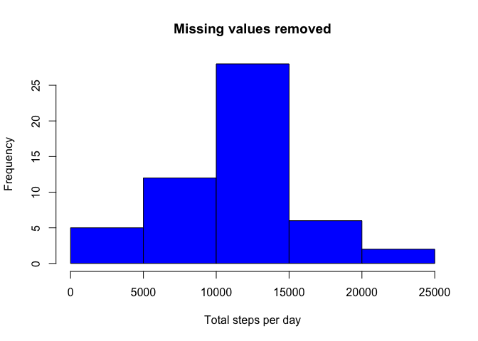
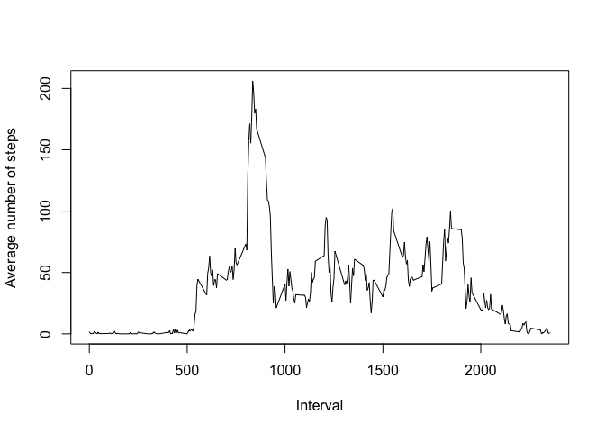
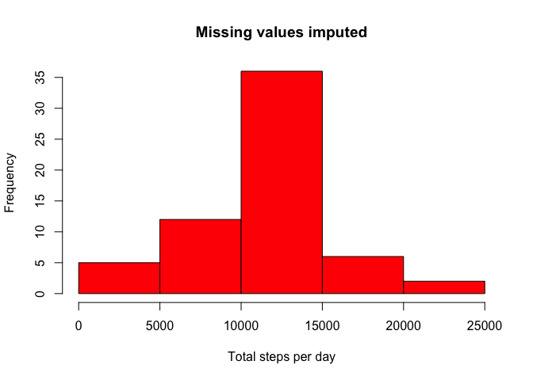
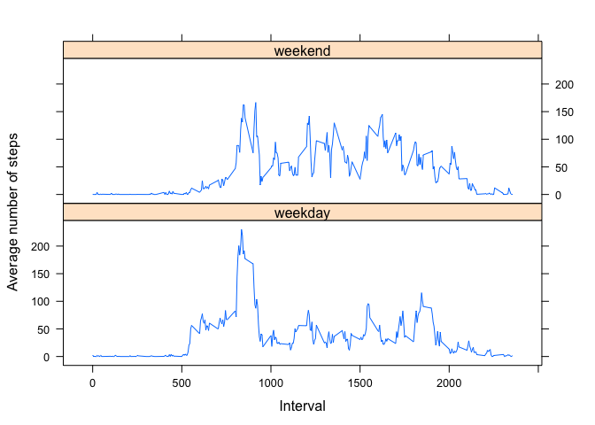

# Reproducible Research: Peer Assessment 1

In this analysis we use activity data collected from an individual over two months to investigate levels of activity throughout the day, and on different days of the week. The variables in the dataset are:

* steps: the number of steps in 5 minute intervals
* date: the date on which the measurement was taken
* interval: the identifier for the 5 minute interval when the measurement was taken

The data are stored in a comma-separated .csv file, with 17,568 observations in total.

## Loading and preprocessing the data

Since we are provided with a zipped data file, first unzip it:

```r
unzip("activity.zip")
```
This creates activity.csv in the current directory. Load it:

```r
activity = read.csv("activity.csv", sep = ",")
```

## What is mean total number of steps taken per day?

For this part of the assignment we can ignore missing values in the dataset. Therefore, let's create a new dataframe without missing values:

```r
activity_omitna = na.omit(activity)
```

#### Make a histogram of the total number of steps taken each day
Sum all the steps taken per day, aggregating the intervals:

```r
totalSPDomitna <- aggregate(steps ~ date, activity_omitna, sum)
```
Now make the histogram:

```r
hist(totalSPDomitna$steps,xlab = "Total steps per day", main = "Missing values removed", col = "blue")
```

 

#### Calculate and report the **mean** and **median** total number of steps taken per day
We can do this using the aggregated dataset:

```r
mean(totalSPDomitna$steps)
```

```
## [1] 10766.19
```

```r
median(totalSPDomitna$steps)
```

```
## [1] 10765
```
Recall that the mean is the sum of all values divided by the number of values, and the median is the middle value when values are ordered. Considering the histogram, these values seem reasonable.

## What is the average daily activity pattern?

#### Make a time series plot (i.e. `type = "l"`) of the 5-minute interval (x-axis) and the average number of steps taken, averaged across all days (y-axis)

Since we are not told otherwise, we are still ignoring missing values in the dataset.
Aggregate over days and average the number of steps per 5 minute interval:

```r
averageSPIomitna <- aggregate(steps ~ interval, activity_omitna, mean)
```
Now make a line plot:

```r
plot(averageSPIomitna$interval, averageSPIomitna$steps, type="l", xlab = "Interval", ylab = "Average number of steps")
```

 

#### Which 5-minute interval, on average across all the days in the dataset, contains the maximum number of steps?
We can use the averageSPIomitna dataset created for the previous plot.
The maximum number of steps:

```r
max(averageSPIomitna$steps)
```

```
## [1] 206.1698
```
This corresponds to interval:

```r
averageSPIomitna[which.max(averageSPIomitna$steps),1]
```

```
## [1] 835
```
So, on average across all the days, interval 835 contains the maximum number of steps.
The average number of steps in this interval is 206.1. These figures seem reasonable considering the previous plot.

## Imputing missing values

#### Calculate and report the total number of missing values in the dataset (i.e. the total number of rows with `NA`s)
We can calculate the total number of rows with NAs by comparing activity and activity_omitna:

```r
nrow(activity) - nrow(activity_omitna)
```

```
## [1] 2304
```
We can also count the total number of missing values in the original dataset:

```r
sum(is.na(activity))
```

```
## [1] 2304
```
This confirms that only values for steps are missing. There are 2304 missing values in the dataset. As a fraction of the total number of observations, this is:

```r
2304 / 17568
```

```
## [1] 0.1311475
```
So 13% of rows are missing values.

#### Devise a strategy for filling in all of the missing values in the dataset
We are suggested two options:

* use the mean/median for that day
* use the mean for that 5-minute interval

Other options could be:

* use the value of the nearest complete interval from that day
* use the value of the same interval from the next/previous day

None of the methods is perfect. I chose to use the mean for that 5-minute interval, averaging across all days. Note that this may wash-out effects due to differences in day. A more throrugh analysis might try several strategies for imputing missing data, and see the different effect each strategy had. 

#### Create a new dataset that is equal to the original dataset but with the missing data filled in
Make a copy of the original dataset ready for editing:

```r
activity_imputena <- activity
```
Use previously calculated averageSPIomitna dataframe to find the average values to replace the NA values:

```r
for(i in 1:nrow(activity_imputena)){
  if (is.na(activity_imputena[i,1])){
    matching_interval_i = which(averageSPIomitna$interval == activity_imputena[i,3])
    activity_imputena[i,1] <- averageSPIomitna[matching_interval_i, 2]
  }
}
```

#### Make a histogram of the total number of steps taken each day
Again we do:

```r
totalSPDimputena <- aggregate(steps ~ date, activity_imputena, sum)
hist(totalSPDimputena$steps,xlab = "Total steps per day", main = "Missing values imputed", col = "red")
```

 

#### Calculate and report the **mean** and **median** total number of steps taken per day
And again:

```r
mean(totalSPDimputena$steps)
```

```
## [1] 10766.19
```

```r
median(totalSPDimputena$steps)
```

```
## [1] 10766.19
```
#### Do these values differ from the estimates from the first part of the assignment? What is the impact of imputing missing data on the estimates of the total daily number of steps?
The mean value is the same as the estimate from the first part of the assignment. This is to be expected - we added more values, but each value was equal to the original mean and so the contribution of imputed values doesn't affect the original. The median value has changed slightly, from 10765 to 10766.19. Recall that the median value is the middle value when the dataset is ordered. This tells us that the middle value is one of the values we imputed (otherwise it should be an integer).

## Are there differences in activity patterns between weekdays and weekends?
We continue to use the dataset with imputed values.

#### Create a new factor variable in the dataset with two levels -- "weekday" and "weekend" indicating whether a given date is a weekday or weekend day.
First let's add a column for the new factor variable:

```r
activity_imputena$EndOrDay <- "unknown"
```
Now loop to fill this variable for weekend or weekday:

```r
weekenddays <- c("Saturday","Sunday")
activity_imputena$EndOrDay <- factor((weekdays(as.Date(activity_imputena$date)) %in% weekenddays), levels = c(FALSE,TRUE), labels = c("weekday","weekend") )
```

#### Make a panel plot containing a time series plot (i.e. `type = "l"`) of the 5-minute interval (x-axis) and the average number of steps taken, averaged across all weekday days or weekend days (y-axis).
Average the number of steps per interval and per week/weekend day:

```r
averageSPIimputena <- aggregate(steps ~ interval+EndOrDay, activity_imputena, mean)
```
Now plot the panels, using the lattice library:

```r
library(lattice)
xyplot(averageSPIimputena$steps ~ averageSPIimputena$interval | factor(averageSPIimputena$EndOrDay), type = 'l',layout = c(1,2), xlab = "Interval", ylab = "Average number of steps")
```

 

Yes, there are differences between the individual's average behaviour on a weeday versus a weekend day. On average, the person becomes active later in the day on the weekend. Their peak activity is lower on the weekend. However, they are more consistently active throughout the day on the weekend.
